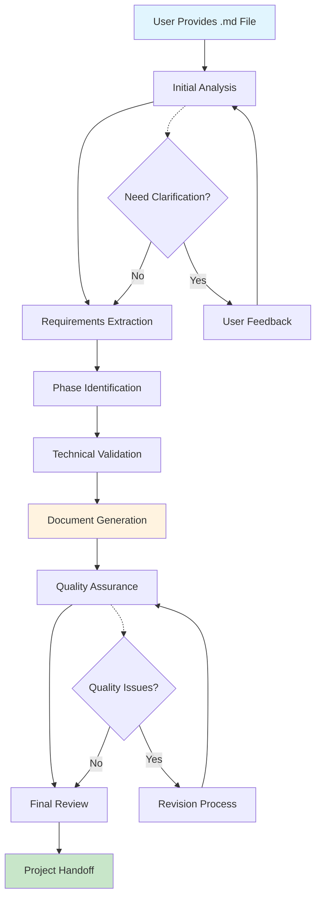
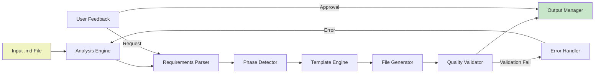
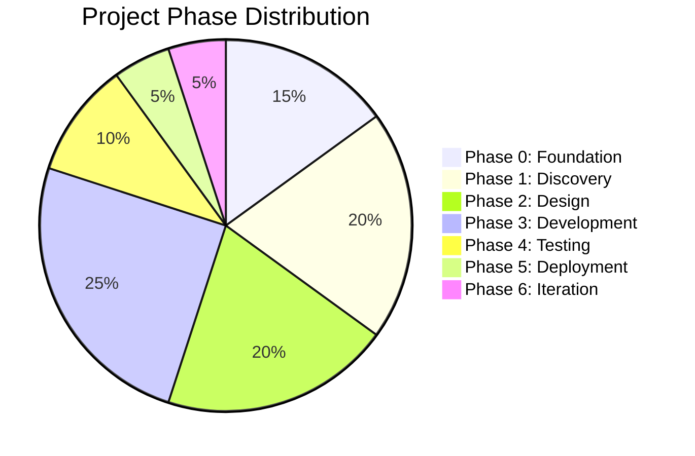
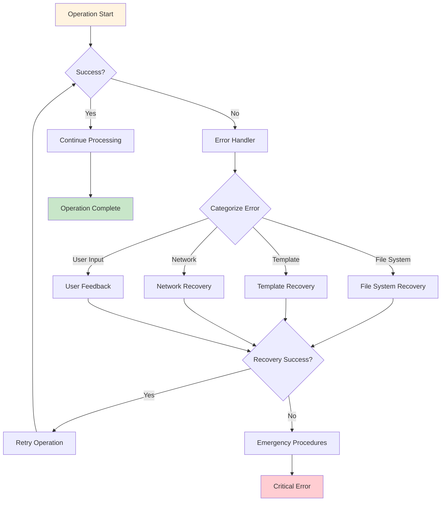
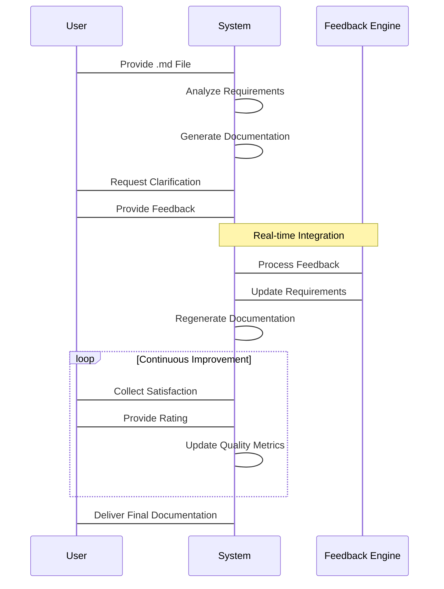
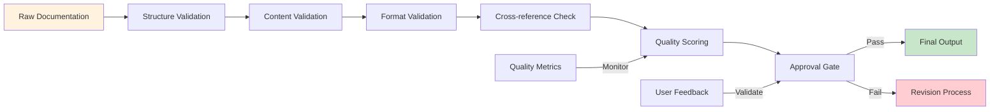
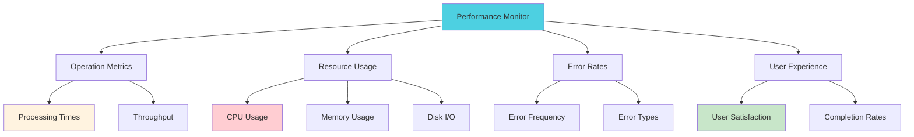
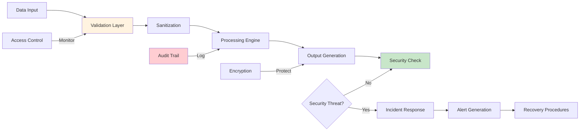
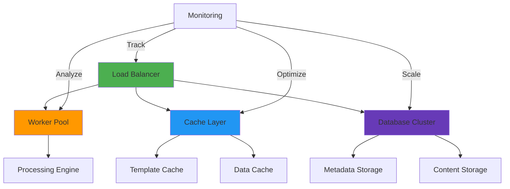

# Hackathon Helper Skill

This skill processes hackathon project documentation and generates comprehensive planning materials. It reads a provided .md file, creates a project folder structure, and generates all necessary documentation files following the specified requirements.

## When to Use This Skill

**Trigger conditions:**
- User provides a .md file describing a hackathon project
- User needs comprehensive project documentation generated
- User wants structured planning materials for a hackathon project

**Initial offer:**
Offer to process the provided hackathon documentation and generate a complete project structure with all required files. Explain that the skill will:

1. Read and analyze the provided .md file
2. Create a project folder with the same name
3. Generate constitution.md and claude.md files
4. Create phase-specific specification files (spec-1.md, spec-2.md, etc.)
5. Generate corresponding step-by-step guide files (guide-1.md, guide-2.md, etc.)
6. Ask about MCP server connections
7. Ensure all output follows requirements from the document

Ask if they want to proceed with processing their project documentation.

## Stage 1: Project Analysis

**Goal:** Analyze the provided .md file to understand project requirements and structure.

### Initial Analysis

1. **Read the provided .md file** to understand the project overview
2. **Extract key information:**
   - Project name and description
   - Phases or stages mentioned
   - Requirements and constraints
   - Technical stack and tools
   - Timeline and milestones

3. **Identify phase structure:**
   - How many phases are defined?
   - What are the deliverables for each phase?
   - What are the success criteria?

4. **Extract technical requirements:**
   - Required technologies and tools
   - Integration needs
   - Security considerations

### Context Validation

**If the document mentions specific tools or technologies:**
- Ask if MCP servers should be connected for those tools
- Verify understanding of technical requirements
- Clarify any ambiguous requirements

**If the document mentions team roles or collaboration:**
- Ask about team structure and collaboration tools
- Clarify communication channels and workflows

### Information Extraction

As the document is analyzed, track:
- What's clearly defined
- What's ambiguous or needs clarification
- Technical requirements that need verification
- Timeline and milestone expectations

**Asking clarifying questions:**

Generate 5-10 questions based on gaps in the project requirements:
- Technical specifications that need more detail
- Timeline assumptions that should be verified
- Resource allocation questions
- Success criteria definitions

Inform them they can answer in shorthand or provide additional context as needed.

**Exit condition:**
Sufficient analysis has been completed when:
- Project scope is clearly understood
- All phases are identified
- Technical requirements are documented
- Timeline and milestones are clear

**Transition:**
Ask if there's any more project information they want to provide, or if the analysis is complete and ready to proceed to documentation generation.

## Stage 2: Documentation Generation

**Goal:** Generate all required documentation files based on the analyzed requirements.

### Project Structure Creation

1. **Create project folder:**
   - Use the same name as the .md file (without extension)
   - Create in the root directory
   - Verify the folder was created successfully

2. **Generate core documentation files:**
   - constitution.md - Project constitution and principles
   - claude.md - Claude-specific guidelines and integration

3. **Generate phase-specific files:**
   - spec-1.md, spec-2.md, etc. for each identified phase
   - guide-1.md, guide-2.md, etc. for each phase

### File Generation Process

**For each phase:**

#### Step 1: Specification File Creation

Create spec-[n].md with:
- Phase overview and objectives
- Detailed requirements and deliverables
- Technical specifications
- Timeline and milestones
- Success criteria
- Dependencies and prerequisites

#### Step 2: Guide File Creation

Create guide-[n].md with:
- Step-by-step implementation instructions
- Tools and resources needed
- Common pitfalls and solutions
- Testing and validation procedures
- Handoff and integration points

### Quality Assurance

After generating each file:
- Verify file contents match the requirements
- Check for completeness and consistency
- Ensure proper formatting and structure
- Validate that all technical requirements are addressed

**If any issues are found:**
- Go back and fix the specific file
- Verify the fix meets requirements
- Continue with the next file

### MCP Server Integration

**Ask user:**
"Which MCP servers will be connected for this project?"

Based on the technical requirements identified:
- List the MCP servers that would be relevant
- Ask if any additional MCP servers are needed
- Verify the MCP server configuration meets project needs

## Stage 3: Final Review and Handoff

**Goal:** Review all generated documentation and prepare for project execution.

### Complete Documentation Review

Review all generated files for:
- Consistency across phases
- Completeness of requirements
- Accuracy of technical specifications
- Proper integration points
- Timeline feasibility

### Final Quality Check

Perform a final review of:
- All specification files (spec-*.md)
- All guide files (guide-*.md)
- Core documentation (constitution.md, claude.md)
- Overall project structure

### User Handoff

**Present the complete project structure:**
- List all generated files and their purposes
- Explain the relationship between phases
- Highlight key integration points
- Review timeline and milestones

**Ask for final confirmation:**
"Are you ready to proceed with the project using this documentation structure?"

**If user needs adjustments:**
- Make specific edits as requested
- Re-verify all related files
- Ensure changes maintain consistency

## Visual Documentation and Workflow Diagrams

### Project Workflow Overview



### Documentation Generation Pipeline



### Phase-Based Project Structure



### Error Handling Flow



### User Feedback Integration



### Quality Assurance Pipeline



### Integration Architecture

```mermaid
er diagram
    entity "Hackathon Helper" as HH {
        * id: int
        * project_name: string
        * status: enum
    }

    entity "MCP Server" as MCP {
        * id: int
        * server_name: string
        * connection_status: bool
        * capabilities: string
    }

    entity "Template Engine" as TE {
        * id: int
        * template_name: string
        * syntax: string
        * version: string
    }

    entity "Quality Validator" as QV {
        * id: int
        * validation_type: enum
        * threshold: float
        * last_run: datetime
    }

    HH ||--o{ TE : "uses templates"
    HH ||--o{ MCP : "integrates with"
    HH ||--o{ QV : "validated by"

    HH ||--o{ "User Feedback" : "receives"
    HH ||--o{ "Error Handler" : "managed by"
```

### Performance Monitoring Dashboard



### Security Architecture



### Scalability Architecture



These visual documentation and workflow diagrams provide a comprehensive understanding of the Hackathon Helper skill's architecture, processes, and integration points. The diagrams illustrate the complete lifecycle from user input through documentation generation, quality assurance, and final delivery, while highlighting key error handling, feedback integration, and security considerations.

## Enhanced Error Handling and Recovery Framework

**Goal:** Provide robust error handling with detailed recovery procedures and user feedback mechanisms.

### Comprehensive Error Categories

#### File System Errors

**Error Types:**
- File permission denied
- Disk space exhaustion
- Path resolution failures
- Concurrent file access conflicts

**Recovery Procedures:**
```markdown
1. **Permission Errors:**
   - Check directory permissions: `ls -la`
   - Verify user access rights
   - Request elevated permissions if needed
   - Alternative: Use different working directory

2. **Disk Space Issues:**
   - Check available space: `df -h`
   - Clear temporary files if possible
   - Use external storage if available
   - Alert user to space constraints

3. **Path Resolution Failures:**
   - Validate path syntax
   - Check for special characters
   - Use absolute paths when possible
   - Provide path normalization

4. **Concurrent Access Conflicts:**
   - Implement file locking mechanisms
   - Queue file operations
   - Provide conflict resolution options
   - Alert users of concurrent modifications
```

#### Documentation Generation Errors

**Error Types:**
- Template rendering failures
- Data extraction errors
- Format validation issues
- Content generation conflicts

**Recovery Procedures:**
```markdown
1. **Template Issues:**
   - Validate template syntax
   - Check for missing placeholders
   - Provide fallback templates
   - Alert user of template problems

2. **Data Extraction Failures:**
   - Validate input data format
   - Implement error-tolerant parsing
   - Provide data sanitization
   - Alert user of data issues

3. **Format Validation Errors:**
   - Implement comprehensive validation
   - Provide detailed error messages
   - Offer format correction suggestions
   - Validate before processing

4. **Content Generation Conflicts:**
   - Implement content conflict resolution
   - Provide merge capabilities
   - Alert user of content conflicts
   - Offer manual intervention options
```

#### Network and Integration Errors

**Error Types:**
- MCP server connection failures
- API rate limiting
- Authentication errors
- Network timeouts

**Recovery Procedures:**
```markdown
1. **Connection Issues:**
   - Implement retry logic with exponential backoff
   - Provide connection status monitoring
   - Offer offline alternatives
   - Alert user of connectivity issues

2. **Rate Limiting:**
   - Implement rate limit detection
   - Provide rate limit tracking
   - Offer retry scheduling
   - Alert user of rate limit status

3. **Authentication Failures:**
   - Implement credential validation
   - Provide authentication troubleshooting
   - Offer credential refresh options
   - Alert user of authentication issues

4. **Network Timeouts:**
   - Implement timeout detection
   - Provide timeout handling
   - Offer connection alternatives
   - Alert user of network issues
```

### User Feedback Collection Mechanisms

#### Real-time Feedback Collection

**Implementation:**
```markdown
1. **Interactive Prompts:**
   - Use structured prompts for user input
   - Provide clear options and examples
   - Implement input validation
   - Offer context-sensitive help

2. **Progress Indicators:**
   - Show real-time progress updates
   - Provide estimated completion times
   - Offer pause/resume capabilities
   - Display current operation status

3. **Error Reporting:**
   - Provide detailed error messages
   - Offer troubleshooting suggestions
   - Include context for debugging
   - Allow user feedback on errors
```

#### Feedback Collection Points

**Key Interaction Points:**
```markdown
1. **Initial Analysis Phase:**
   - Collect user requirements clarification
   - Gather technical specification details
   - Document assumptions and constraints
   - Validate project scope

2. **Documentation Generation Phase:**
   - Collect content approval
   - Gather formatting preferences
   - Document customization requests
   - Validate generated content

3. **Final Review Phase:**
   - Collect comprehensive feedback
   - Gather improvement suggestions
   - Document user satisfaction
   - Validate final deliverables
```

#### Feedback Analysis and Implementation

**Process:**
```markdown
1. **Feedback Categorization:**
   - Group similar feedback items
   - Prioritize based on impact
   - Categorize by severity
   - Track resolution status

2. **Implementation Planning:**
   - Develop implementation strategies
   - Estimate effort and resources
   - Plan integration points
   - Schedule implementation timeline

3. **Quality Assurance:**
   - Test feedback implementations
   - Validate improvements
   - Gather user validation
   - Document changes and impacts
```

### Advanced Technical Implementation Details

#### File System Operations

**Enhanced Operations:**
```markdown
1. **Atomic File Operations:**
   - Use temporary files for safe writes
   - Implement rollback capabilities
   - Provide transaction-like behavior
   - Ensure data integrity

2. **Concurrent Access Handling:**
   - Implement file locking mechanisms
   - Use advisory locks where appropriate
   - Provide conflict resolution
   - Monitor access patterns

3. **Performance Optimization:**
   - Implement caching strategies
   - Use efficient file I/O operations
   - Optimize path resolution
   - Monitor performance metrics
```

#### Documentation Generation Pipeline

**Enhanced Pipeline:**
```markdown
1. **Template Engine Enhancement:**
   - Implement advanced template features
   - Support conditional rendering
   - Provide template inheritance
   - Include error handling in templates

2. **Content Validation:**
   - Implement comprehensive validation
   - Provide detailed validation reports
   - Offer correction suggestions
   - Validate cross-references

3. **Quality Assurance:**
   - Implement automated quality checks
   - Provide quality metrics
   - Offer improvement suggestions
   - Validate against standards
```

#### Integration Framework

**Enhanced Integration:**
```markdown
1. **MCP Server Management:**
   - Implement connection pooling
   - Provide health monitoring
   - Offer automatic reconnection
   - Track server performance

2. **API Integration:**
   - Implement robust API clients
   - Provide error handling
   - Offer retry mechanisms
   - Track API usage

3. **External Tool Integration:**
   - Implement tool abstraction layer
   - Provide configuration management
   - Offer tool monitoring
   - Track integration performance
```

### Quick Reference Guide

#### Common Issues and Solutions

**Quick Reference Table:**

| Issue | Solution | Commands |
|-------|----------|----------|
| Permission Denied | Check permissions, use sudo | `ls -la`, `chmod` |
| Disk Full | Clear temp files, use external storage | `df -h`, `rm -rf` |
| Network Timeout | Check connection, retry with backoff | `ping`, `curl` |
| Template Error | Validate syntax, check placeholders | `template validate` |

#### Emergency Recovery Procedures

**Critical Recovery Steps:**
```markdown
1. **System Failure:**
   - Check system logs: `dmesg`, `journalctl`
   - Verify disk integrity: `fsck`
   - Restore from backup if available
   - Escalate to system administrator

2. **Data Corruption:**
   - Check file integrity: `md5sum`, `sha256sum`
   - Attempt data recovery: `testdisk`, `photorec`
   - Restore from version control
   - Document data loss

3. **Security Breach:**
   - Isolate affected systems
   - Change all credentials
   - Review access logs
   - Conduct security audit
   - Notify stakeholders
```

### Monitoring and Alerting

**Implementation:**
```markdown
1. **Performance Monitoring:**
   - Track operation durations
   - Monitor resource usage
   - Alert on performance degradation
   - Provide performance reports

2. **Error Monitoring:**
   - Track error rates
   - Monitor error patterns
   - Alert on error spikes
   - Provide error analysis

3. **User Experience Monitoring:**
   - Track user satisfaction
   - Monitor feedback patterns
   - Alert on user experience issues
   - Provide UX reports
```

This enhanced error handling and recovery framework provides comprehensive coverage for potential issues while maintaining user-friendly interfaces and effective recovery procedures.